Übung 2: Rasterdaten
====================

Installation
------------

Für die Durchführung der Übung wird die frei verfügbare OpenSource GIS Software **QGIS** benutzt. Viele Funktionen von QGIS werden über Plugins bereitgestellt.

.. _figqgissplash:

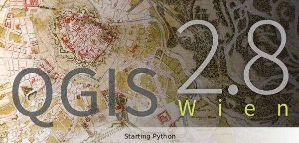
    
    Der Startbildschirm der verwendeten QGIS Version 2.6

Sollten Sie eine der verwendeten Funktionen nicht finden, sehen Sie im QGIS Menü *Erweiterungen (Plugins)* -> *Erweiterungen verwalten und installieren (Manage and Install Plugins...)* nach, ob die entsprechende Funktion installiert und aktiviert ist.

Es wird empfohlen, die Übungen an einem der Rechner im GIS-Lab am Institut zu absolvieren. Es ist jedoch auch möglich, sich die Software auf dem eigenen Computer zu installieren.
Wenn Sie für die Übung angemeldet sind, bekommen Sie automatisch einen Account am Institutsserver zugewiesen. QGIS ist auf diesem Account bereits installiert.

Zugang mit dem eigenen Rechner
''''''''''''''''''''''''''''''

Sie können auch von zu Hause aus über einen Clienten auf Ihrem Account im GIS Labor bearbeiten. Die Client-Software ist unter http://www.x2go.org downloadbar.
Nach der Installation öffnen Sie zur Konfiguration des Clienten in dessen Menü die **Session preferences** und geben im Tab **Session** die folgenden Einstellungen ein:

* Host: ``gi30.geoinfo.tuwien.ac.at``
* Login: <Ihr Benutzername>
* SSH port: ``22``
* Session type: ``Custom desktop``
* Command: ``/usr/bin/startxfce4``

Im Tab **Settings**:

* Keyboard layout: ``de``
* Keyboard model: ``pc105/de``

Nachdem Sie die Einstellungen bestätigt haben, können Sie die Session mit Ihrem Benutzernamen und Passwort starten.

QGIS auf dem eigenen Rechner
''''''''''''''''''''''''''''

Sollten Sie QGIS auf Ihrem Computer installieren wollen, finden Sie unter der Adresse http://www.qgis.org im Bereich Download die Dateien für die Installation von QGIS auf Linux, Mac OS X und Windows.

Daten
-----

Die Daten finden Sie im TUWEL-Kurs zur Übung. Sollten Sie im GIS-Lab oder über den x2go-Client arbeiten, verwenden Sie am besten den Firefox Browser und laden sich die Daten in ein eigenes Verzeichnis.

Wir werden in dieser Übungseinheit hauptsächlich mit **Rasterdaten** (Abbildung :num:`#figrasterlayer`) arbeiten.

.. _figrasterlayer:

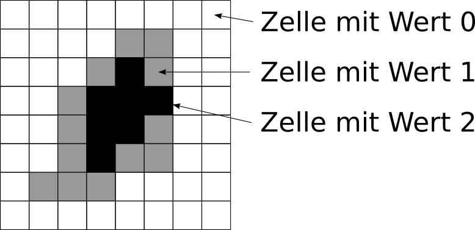
    
    Der prinzipielle Aufbau eines Rasterlayers

Ein Rasterlayer ähnelt einem digitalen Photo. Wenn man weit genug hineinzoomt kann man die **einzelnen Zellen** erkennen, aus denen sich ein Raster zusammensetzt. Jede Zelle besitzt einen bestimmten Wert. Der gesamte Rasterlayer kann unterschiedlich eingefärbt werden oder auch nur Graustufen besitzen.

Start
-----

Sollten Sie im **GIS-Lab** oder über den **x2go-Client** arbeiten, finden sie QGIS im *Applications Menu* unter *Education* -> *QGIS Desktop* (siehe Abbildung :num:`Abbildung #figserver`).

.. _figserver:

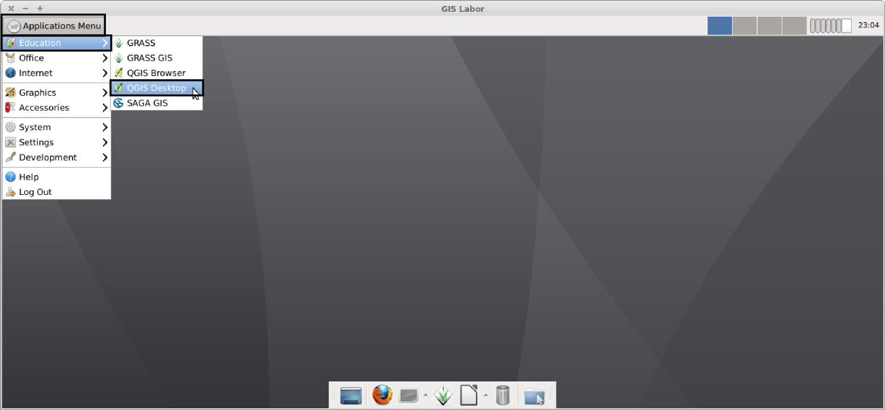
    
    Desktopumgebung im GIS-Lab

Alternativ können Sie auch den Kommandozeilenbefehl `qgis` verwenden, um QGIS zu starten.

Quellen von Geodaten
--------------------

Mit QGIS können wir **Daten direkt aus jedem beliebigen Verzeichnis** öffnen. Der Übersicht halber ist es jedoch ratsam, alle Daten, welche zu einem Projekt gehören, in einem einzelnen Verzeichnis zusammen zu speichern.
Dabei kann man verschiedene Unterverzeichnisse erstellen um beispielsweise Rasterdaten und Vektordaten zu trennen.

Bei **größeren Projekten** ist es üblich, dass die Geodaten in einem speziellen **Datenbanksystem** gespeichert werden. Das hat unter anderem den Vorteil, dass der Zugriff auf die Daten schneller erfolgt oder Zugangsbeschränkungen eingerichtet werden können. QGIS kann auch solche Datenbanken öffnen.

Eine weitere wichtige Ressource für Geodaten sind **online Dienste** (WFS, WMS, etc ...). Nach Angabe einer URL wird eine Liste aller dort verfügbaren Geodaten angezeigt. Man kann nun auswählen, welche Daten man laden möchte. Der Zugriff auf diese Quellen ist mit QGIS ebenfalls möglich.

Einige wenige Datensätze, welche keine Geodaten im eigentlichen Sinn sind, können ebenfalls von QGIS geöffnet werden. Dazu zählen beispielsweise Tabellen.

Ein neues Projekt
-----------------

QGIS besteht aus einem einzigen Programmfenster mit **Menüleiste**, mehreren **Symbolleisten**, einer **Kartenanzeige** und verschiedenen **Andockfenstern**.
Sobald das Programm gestartet wurde, wird automatisch ein neues, leeres QGIS Projekt erzeugt.

Koordinatensystem einstellen
----------------------------

Bevor wir Daten laden, sollten wir ein **Koordinatensystem für das gesamte Projekt** definieren. Falls wir dies nicht tun, wird QGIS auf die Standardeinstellung zurückfallen und annehmen, dass alle Daten, welche wir laden werden, im gleichen Koordinatensystem liegen. In vielen Fällen ist diese Annahme korrekt, doch ist es klug, dennoch immer explizit das benutzte Koordinatensystem anzugeben.

.. _figsrs:

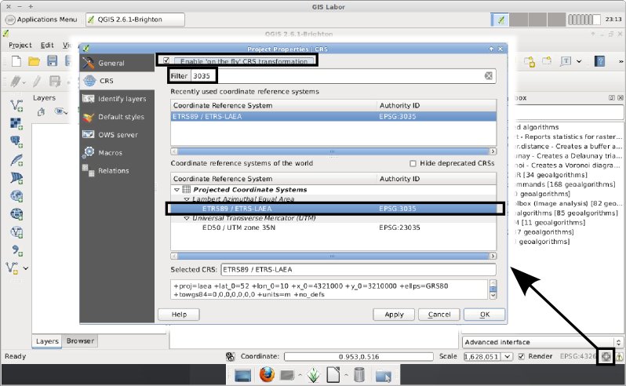
    
    Einstellen eines Koordinatensystems für das gesamte Projekt

Um das Koordinatensystem des gesamten Projekts zu definieren, klicken wir auf das **Icon rechts unten im QGIS Programmfenster** (siehe Abbildung :num:`#figsrs`). Daraufhin öffnet sich das Fenster mit dem Titel `Project Properties | CRS (Projekteigenschaften | KBS)`.
Zunächst sollten Sie sicherstellen, dass die Option `Enable 'on the fly' CRS transformation (Spontan-KBS-Transformation aktivieren)` **aktiviert** ist. Nur dann wird QGIS (nur für die Anzeige) alle anderen Daten in das Kooridinatensystem umrechnen, welches wir nun einstellen.
In diesem Fenster geben wir im Feld `Filter` die **EPSG Nummer** ``3035`` ein [#f1]_. Dies bewirkt, dass in der Liste mit verfügbaren Koordinatensystemen nur mehr jenes angezeigt wird, welches die EPSG Nummer 3035 besitzt.
Dieses trägt auch den Namen `ETRS89 / ETRS-LAEA`, welches wir auswählen. Danach bestätigen wir diese Auswahl mit dem `OK` Knopf unten rechts.

Daten und Metadaten
-------------------

Um in QGIS Geodaten zu öffnen, kann man entweder auf ein dem Datentyp entsprechendes **Icon in der Symbolleiste** klicken, oder das **`Browser` Fenster** nutzen (siehe Abbildung :num:`#figload`), um ähnlich wie in einem Dateimanager durch die Verzeichnissen auf dem Computer zu navigieren.

.. _figload:

.. figure:: images/qgis_data.png
    
    Möglichkeiten, Daten zu laden

Als ersten Schritt **öffnen wir die Datei ``elevation_srtm.tif``**. Dazu doppelklicken wir auf die Datei im `Browser` Fenster oder öffnen den `Add Raster Layer (Rasterlayer Hinzufügen)` Dialog (zweites Icon von oben in der gelb markierten Symbolleiste in Abbildung :num:`#figload`).
Es ist auch möglich die Datei aus einem Dateibrowser heraus direkt auf das QGIS Fenster zu ziehen.

Das Programmfenster zeigt nun die soeben geladene Datei im Kartenfenster in der Mitte (Abbildung 3.6).

.. _figsrtm:

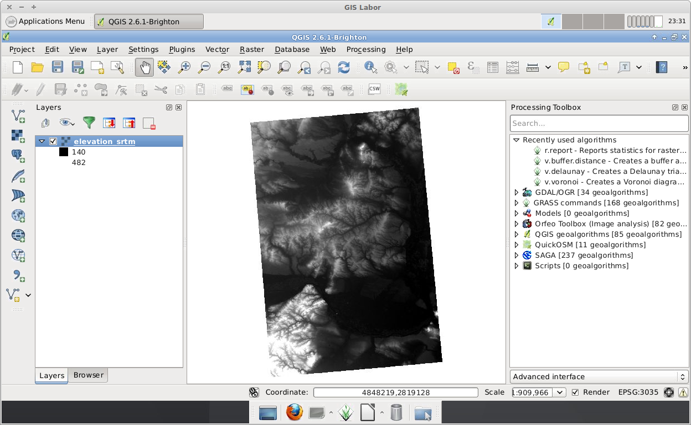
    
    Die Datei elevation_srtm.tif in QGIS

Die Datei ``elevation_srtm.tif`` beinhält **Höhenwerte** der NASA Shuttle Radar Topography Mission (SRTM) [#f2]_.
Alle in QGIS geöffneten Daten werden als `Layer` bezeichnet. Wenn mehrere Datensätze gleichzeitig geladen sind, werden diese einzelnen Layer übereinander gelegt. Diese Layer kann man einzeln ein- und ausschalten oder auch deren Reihenfolge ändern. Dies geschiet in der `Layers` Ansicht (das Fenster rechts in Abbildung 3.6).

Um die **Metadaten** zu einem einzelnen Layer anzusehen, kann man eine Funktion des `Properties (Eigenschaften)` Fensters nutzen. Dieses **Eigenschaftsfenster für einen Layer** öffnet man, indem man mit der **rechten Maustaste** darauf klickt und im daraufhin erscheinenen Menü auf `Properties (Eigenschaften)` klickt (siehe Abbildung :num:`#figsprop`).

.. _figsprop:

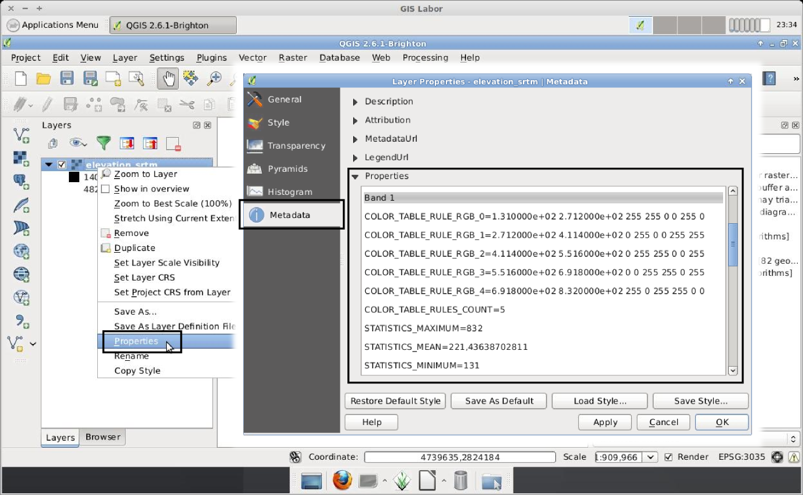
    
    Das Eigenschaftsfenster eines Rasterdatensatzes

In diesem Eigenschaftsfenster klicken wir auf den Punkt `Metadata`. Unter dem Abschnitt `Properties (Eigenschaften)` werden eine **Vielzahl allgemeiner Informationen** angezeigt.

.. topic:: Aufgabe 2
    
    Beantworten Sie mit Hilfe der Metadaten des SRTM Layers folgende Fragen:
    
    * Wieviele Kanäle (auf Englisch `Band` genannt) besitzt dieser Layer?
    * Finden Sie die minimalen und maximalen Höhenwerte.
    * Mit welchem Datentyp sind die Werte im Layer gespeichert?
    
    Für diese Aufgabe müssen Sie keinen Screenshot abgeben.

Verändern der Anzeige
---------------------

Die Kartenanzeige kann **verschoben** werden und man kann **hinein- oder hinauszoomen**.  Solange die Funktion `Pan Map` (siehe Abbildung :num:`#figsmove`) aktiv ist, kann mit der Maus das Kartenfenster verschoben werden. Auch wenn diese Funktion gerade nicht aktiv ist, kann man durch Klicken und Halten der **mittleren Maustaste** den gleichen Effekt erzielen.

.. _figsmove:

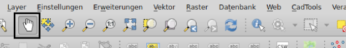
    
    Symbolknopf für die Funktion `Pan Map (Karte verschieben)`

Gezoomt kann im einfachsten Fall mit dem **Mausrad** werden. Falls man einmal den Bezug verlieren sollte und nicht mehr zur Ansicht der geladenen Daten zurückfindet, kann man mit dem Knopf `Zoom Full` (siehe Abbildung :num:`#figsausdehnung`) auf alle gerade geladenen Daten zoomen.

.. _figsausdehnung:

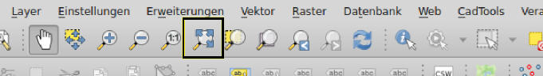
    
    Symbolknopf für die Funktion `Zoom Full (Volle Ausdehnung)`

.. topic:: Aufgabe 3
    
    * Stellen Sie sicher, dass die SRTM Höhenkarte geladen ist und zoomen Sie in einen beliebigen Bereich hinein. Speichern Sie diese Ansicht mit der Funktion `Bild speichern als...`, welche Sie im Menüpunkt `Projekt` finden.

Mit der Abfragefunktion `Identify Features` (siehe Abbildung :num:`#figsinfo`) lässt sich mit einem Mausklick der Wert der Höhenkarte an der Position des Mausklicks anzeigen.
So kann mit nur einem Mausklick die **Höhe jeder Position der Karte** ermittelt werden.

.. _figsinfo:

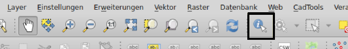
    
    Symbolknopf für die Funktion `Identify Features (Objekte Abfragen)`

Farbtabellen
------------

Wir laden nun einen weiteren Datensatz aus der Datei `corine.tif` in das QGIS Projekt. Diese **Corine Land Cover Classification** wird von der European Environment Agency [#f3]_ bereitgestellt. In der Datei `clc_legend.csv` kann man eine kurze **Beschreibung der Landbedeckungsklassen** finden.
Als nächstes wollen wir diese Beschreibungen zu den Klassennummern der Rasterdatei hinzufügen. Erfreulicher weise wird speziell für QGIS bereits eine Datei zur Verfügung gestellt, die **die einzelnen Rasterwerte den Landbedeckungsklassen zuordnet**.

.. _figsfarbpalette:

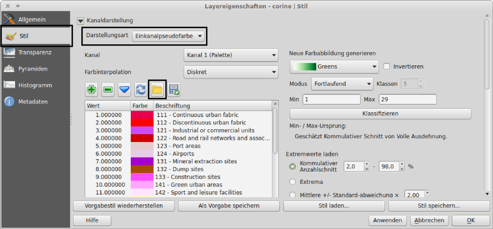
    
    Das Einstellungsfenster zur Konfiguration einer Farbpalette

Um diese **Datei zu laden**, öffnen wir diesmal das `Properties (Eigenschaften)` Fenster des Corine Layers und gehen auf den Menüpunkt `Style (Stil)` (siehe Abbildung :num:`#figsfarbpalette`).
Danach ändern wir den `Render type (Darstellungsart)` auf `Singleband pseudocolor (Einkanalpseudofarbe)`. Nun klicken wir auf den Knopf `Load color map from file (Farbabbildung aus Datei laden)` (siehe Markierung in der Abbildung) und wählen die Datei `clc_legend_qgis.txt` aus den Übungsdaten aus. Diese Datei beinhält die Zuordnung der Rasterwerte zu den Landbedeckungsklassen.
Nach einem Klick auf `OK`, erscheinen nun **neben den Farben (Spalte `Color (Farbe)`) der einzelnen Rasterwerte** (Spalte `Value (Wert)`) auch die **Bezeichnungen der Landbedeckungsklassen (Spalte `Label (Beschriftung)`)**.

Wechseln wir nun zur Ansicht `Histogram` (siehe Abbildung :num:`#figshistogram`). Hier wird die **Häufigkeit der einzelnen Rasterwerte** angezeigt. Die **horizontale Achse** namens `Pixel Value (Pixelwert)` beschreibt die einzelnen Rasterwerte, die **vertikale Achse** namens `Frequency (Frequenz)` beschreibt die Häufigkeit der einzelnen Rasterwerte.

.. _figshistogram:

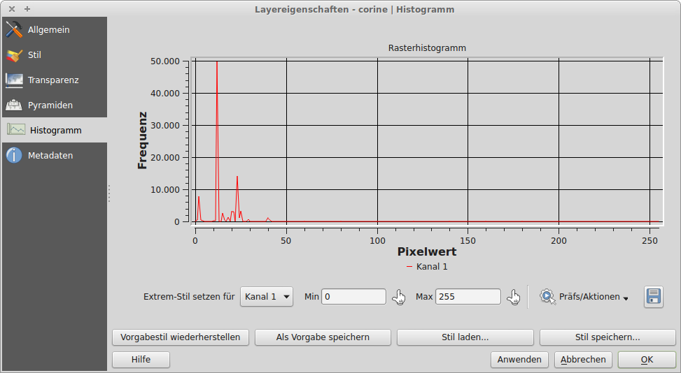
    
    Das Histogrammfenster

.. topic:: Aufgabe 4
    
    * Finden sie mithilfe des Histograms den häufigsten Rasterwert (Pixelwert) heraus. Sie können mit der **Maus in das Histogram hineinzoomen**, um den genauen Wert herauszufinden. Wenn sie den Wert ermittelt haben, welchsen Sie zurück zur `Style` Ansicht und vergleichen den von Ihnen gefundenen Rasterwert mit der zugehörigen Beschriftung. So ermitteln sie den **Namen der häufigsten Bodenbedeckungsklasse**. Notieren Sie diese.
    
    Für diese Aufgabe müssen Sie keinen Screenshot oder Kartenbild abgeben.

Berechnung von Konturlinien
---------------------------

Isolinien verbinden Punkte gleichen Wertes eines kontinuierlichen Feldes. Meistens wird durch das Feld eine physikalische Größe beschrieben. In QGIS kann man Isolinien mit der Funktion `Contour (Kontur)` berechnen. Man findet diese im Menü `Raster` -> `Extraction`. Der sich nun öffnende Dialog sieht aus wie in Abbildung :num:`#figscontour` dargestellt.

.. _figscontour:

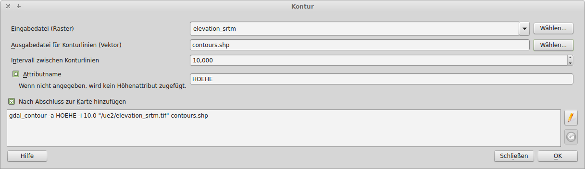
    
    Die Funktion zum Erstellen von Konturlinien

Unter dem Feld `Input file (Eingabedatei)` wählen wir unsere **Höhendaten** namens `elevation_srtm` aus.
Im Feld `Output file for contour lines (Ausgabedatei für Konturlinien)` geben wir die Datei an, in der die Isolinien **gespeichert** werden.
Unter `Interval between contour lines (Intervall zwischen Konturlinien)` wird die **Schrittweite zwischen den einzelnen Konturlinien** angegeben. Die Schrittweite sollte im Allgemeinen **nicht zu dicht** gewählt werden, um das Gelände nicht zu überdecken, aber auch **nicht zu weit**, da ansonsten wichtige Informationen über die Variation des Feldes verloren gehen.
Es ist zu empfehlen, die Felder `Attribute name (Attributname)` und `Load into canvas when finished (Nach Abschluss zur Karte hinzufügen)` **anzuhaken**.

.. topic:: Aufgabe 5
    
    * Überlegen Sie sich eine geeignete Schrittweite und berechnen Sie Konturlinien aus dem SRTM Höhenraster. Legen Sie die Höhenlinien über die Höhenkarte und speichern Sie die Karte abermals als Bild unter einem aussagekräftigen Namen ab und notieren sie die Schrittweite, die Sie verwendet haben.

Geländeneigung
--------------

Als letzten Punkt wollen wir noch die **Geländeneigung** berechnen. Der Wert `slope` repräsentiert die Geländeneigung am **Ort einer Zelle**. Die Geländeneigung kann in **Grad oder in Prozent** berechnet werden. Mit dem Befehl `DEM (Terrain models) (DHM (Geländemodell) )` im Menüpunkt `Raster` -> `Analysis` lässt sich dieser Wert berechnen.

In Abbildung :num:`#figsneigung` kann man den Dialog zum Erstellen der Neigung sehen. Stellen auch Sie ihn entsprechend ein und definieren Sie einen `Output file (Ausgabedatei)`. Beachten Sie, dass bei manchen Betriebssystemen der Dateiname die **Endung .tif** haben muss. Ansonsten tritt ein **Fehler** beim Ausführen der Funktion auf.

.. _figsneigung:

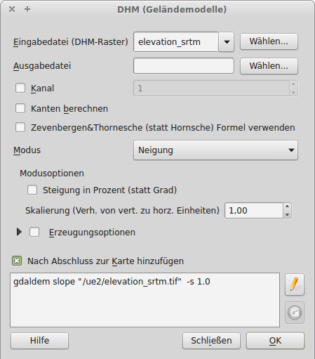
    
    Die Funktion zum Berechnen der Neigung (auf Englisch nennt sich der Modus "Slope")

Die Ansicht der Neigungskarte lässt sich noch weiter optimieren. Nehmen wir an, wir sind ausschließlich an Neigungen zwischen 5° und 10° interessiert. Um genau diesen Bereich darzustellen, öffnen wir das `Properties (Eigenschaften)` Fenster des neu erstellen Neigungs-Layers und welchseln auf die `Style (Stil)` Ansicht. Dort setzen wir die Option `Render type (Darstellungsart)` abermals auf den Eintrag `Singleband pseudocolor (Einkanalpseudofarbe)` und `Color interpolation (Farbinterpolation)` auf `Discrete`.

.. |plus| image:: /images/mActionSignPlus.png
    :scale: 50%

Nun können wir die einzelnen Einträge hinzufügen, um die Neigungsdaten umzufärben. Mit einem Klick auf das |plus| Symbol wird ein neuer Eintrag hinzugefügt. Die Eigenschaften des neu erzeugten Eintrages können nun verändert werden. Wir belassen die Spalte `Value (Wert)` bei `0`, aber ändern dessen `Color (Farbe)` auf ein einfaches Weiß. Ein weiterer Eintrag sollte den `Wert` `4,999` besitzen und abermals `Weiß` als `Farbe` eingestellt werden. Dies bewirkt, dass alle Werte zwischen `0` und `4,999` als Weiß angezeigt werden. Durch weitere Einträge kann man nun den Bereich zwischen `5` und `10` in einer anderen Farbe darstellen, weitere Werte darüber wieder mit der Farbe `Weiß`.

.. topic:: Aufgabe 6
    
    * Berechnen Sie die Neigung
    * Passen Sie den Stil des Neigungsdatensatzes wie oben beschrieben an
    * Speichern Sie die Ansicht der Neigungkarte als Bild unter einem aussagekräftigen Namen.

Speichern des Projekts
----------------------

Sie können das QGIS Projekt mit dem Menüeintrag `Project` -> `Save as... (Speichern als...)` abspeichern. Bedenken Sie hierbei, dass innerhalb einer Projektdatei nur die Zusammenstellung und das Aussehen der einzelnen Layer gespeichert wird. Die Datensätze selber sind in ihren eigenen Dateien gespeichert. Wenn Sie also ein QGIS Projekt kopieren und weitergeben möchten, müssen sie neben der QGIS Projektdatei auch die Datensätze selber kopieren.

Abgabe
------

Beantworten Sie die Fragen im Text und fügen Sie alle gespeicherten Bilder und Informationen zu einem Dokument zusammen. Geben Sie Ihre fertige Arbeit als pdf in TUWEL ab.

.. [#f1] Der EPSG (European Petroleum Survey Group) Code dient zur Identifikation des Koordinatensystems. Das ETRS89 Koordinatensystem hat den Code 3035. Unter http://spatialreference.org/ref/epsg/3035/ finden Sie eine genauere Beschreibung der Parameter.

.. [#f2] Unter http://dds.cr.usgs.gov/srtm/version2_1/SRTM3/Eurasia/ stehen Höhendaten mit nahezu globaler Abdeckung zum Download zu Verfügung. Die Höhendaten für diese Übung sind in der Datei N48E016.hgt.zip.

.. [#f3] www.eea.europa.eu

.. [#f4] http://www.eea.europa.eu/data-and-maps/data/corine-land-cover-2006-raster-2
