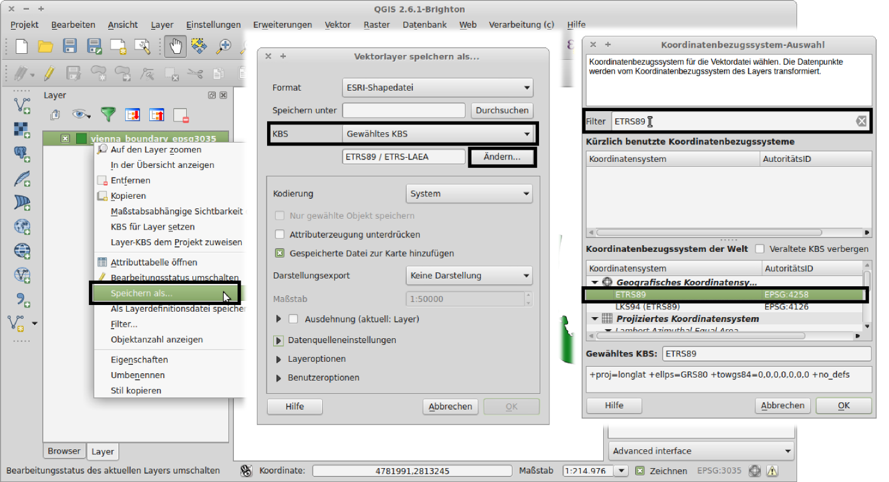
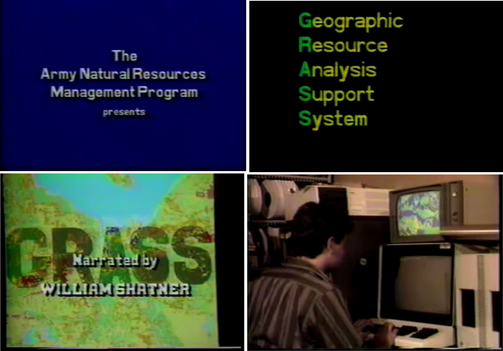

Übung 3: Erweiterte Rateroperationen
====================================

Die Stadt Wien stellt unter http://data.wien.gv.at im Rahmen der Open Government Data (OGD) Initiative Verwaltungsdaten frei zur Verfügung. Die Daten werden unter anderm auch im World Geodetic System 1984 (WGS84) bereitgestellt.

Transformation von WGS84 nach ETRS89
------------------------------------

Die Daten der Stadt Wien liegen in einem anderen Koordinatensystem als die SRTM– und Corine–Daten. Mit QGIS stellt dies kein Problem dar. Richtig konfiguriert, werden die Koordinaten der unteschiedlichen Daten (nur für die Anzeige) derart umgerechnet, dass diese zusammenpassen (vergleiche Abbildungen :num:`#figumprojektion2` und :num:`#figumprojektion1`).

.. _figumprojektion2:

    
    Wenn Layer unterschiedlicher Koordinatensysteme nicht umprojelziert werden, liegen diese nicht übereinander (die Anzeige im GIS stimmt nicht)

.. _figumprojektion1:

    
    Wenn Layer unterschiedlicher Koordinatensysteme umprojeziert werden, dann werden diese richtig dargestellt (die Anzeige im GIS stimmt)

Dazu müssen Sie sicherstellen, dass (wie im vorherigen Aufgabenblatt in :ref:`koordinatensystem`) ein eindeutiges Koordinatensystem für das gesamte Projekt eingestellt ist. QGIS übernimmt nun den Rest und rechnet die Koordinatensysteme aller Layer in jenes des gesamten Projekts um.

Wenn man Berechnungen mit diesen Daten anstellen will ist es jedoch notwendig, dass diese im gleichen Koordinatensystem vorliegen. Ansonsten kommt es zu fehlerhaften Ergebnissen. Zu diesem Zweck können wir diese umprojeziert abspeichern. Die zuvor beschriebene automatische Umprojektion betrifft nur die Anzeige der Daten.
Mit einem Rechtsklick auf den Eintrag des geladenen Layers in der Layeransicht (rechts von der Kartenanzeige in GIS), kann im sich öffnenden Kontextmenü der Eintrag *Save As (Speichern Als)* ausgewählt werden. Es öffnet sich ein Einstellungsfenster für den Export des ausgewählten Layers (siehe Abbildung :num:`#figsaveas`).
In diesem Fenster muss nun der Eintrag für *CRS (KBS)* auf *Selected CRS (Gewähltes KBS)* gesetzt werden, damit wir manuell ein Koordinatensystem auswählen können, in das die Daten, die wir exportieren wollen, umgerechnet werden.

.. _figsaveas:

    
    Um einen Layer umzuprojezieren, müssen wir diesen mit einem neuen Koordinatensystem exportieren und laden

Suchen Sie nach dem Eintrag `ETRS89`, wählen Sie diesen aus und bestätigen Sie die Auswahl mit dem `OK` Knopf.
Im Feld *Save as (Speichern unter)* muss nun noch ein Dateiname angegeben werden, in die die umprojezierten Daten gespeichert werden sollen.
Wennd das Feld *Gespeicherte Datei zur Karte hinzufügen* angehakt ist, müssen wir keine weiteren Schritte unternehmen, um die exportierten Daten zu laden. Mit einem Klick auf das `OK` Feld werden diese unprojeziert, in die neue Datei gespeichert und diese automatisch in QGIS geladen.

.. topic:: Aufgabe 7
    
    * Stellen Sie sicher, dass das Koordinatensystem für Ihr Projekt auf ETRS89 eingestellt ist und die *Spontan-KBS-Transformation* aktiviert ist.
    
    * Laden Sie den Datensatz `BEZIRKSGRENZENOGD.shp` aus dem entsprechenden Unterverzeichnis der Daten für die Übung 3 in QGIS und speichern Sie diesen umprojeziert in das Koordinatensystem ETRS89 unter einem aussagekräftigen Namen (beispielsweise `bezirksgrenzenogd_etrs89.shp`) ab. Laden Sie diesen exportierten Layer ebenfalls in QGIS, sofern dies nicht automatisch nach dem Export geschehen ist.

Die Analyse-Toolbox (Processing)
--------------------------------

Neben QGIS gibt es eine ganze Reihe weiterer OpenSource GIS Applikationen, welche über Jahre, manche sogar Jahrzehnte hinweg optimiert und verbessert wurden.
Einige nennenswerte Anwendungen dierser Art sind

* das *System for Automated Geoscientific Analyses* (SAGA), http://www.saga-gis.org/en/index.html
* und das *Geographic Resource Analysis Support System* (GRASS GIS), http://grass.osgeo.org/

.. _figsaga:

    
    Das Logo von SAGA

Insbesondere letzteres hat eine lange Geschichte und gehört zum Urgestein der GIS Welt. Ursprünglich entwickelt von der US Army, wurde es zu einem Zugpferd der OpenSource GIS Community und wird auch heute noch weiterentwickelt. Ein interessantes Werbevideo von 1987 (abrufbar unter https://www.youtube.com/watch?v=U3Hf0qI4JLc ) zeigt den damaligen Entwicklungsstand.

.. _figgrass:

    
    Ausschnitte aus dem GRASS GIS Werbevideo von 1987

Um nicht das Rad neu zu erfinden, gibt es in QGIS die Möglichkeit, auf die Algorithmen dieser anderen GIS Anwendungen zurückzugreifen. Dies geschiet mit der so genannten *Processing* Toolbox (auf Deutsch nennt sich diese *Verarbeitung*). In Abbildung :num:`#figprocessing` ist diese rechts des Kartenfensters zu sehen. Wenn diese nicht angezeigt wird, kann sie über den Menüeintrag `Processing (Verarbeitung)` -> `Toolbox (Werkzeugkiste)` eingeschaltet werden.

.. _figprocessing:

    
    Die Processing Toolbox in QGIS

Im unteren Bereich kann man mittels einer Auswahlliste zwischen dem `Simplified Interface` und dem `Advanced Interface` wählen. Ich empfehle für Experten, welche wir ja werden wollen, das `Advanced Interface`. Mit diesem können wir erkennen, zu welchem GIS Programm der von uns gewählte Geo-Algorithmus gehört.

Um einen bestimmten Algorithmus auszuwählen, kann man sich entweder durch die Baumstruktur der Processing Toolbox klicken oder man gibt einen Suchbegriff in das Suchfenster im oberen Bereich der Toolbox ein. Dies gestaltet sich als sehr effizient, wenn man bereits weiß, welchen Namen der gewünschte Algorithmus trägt.

Reklassifikation
----------------

Stellen Sie nun sicher, dass Sie den **Corine Datensatz** aus Übung 2 geladen haben und die Einkanalpseudofarbenpalette eingestellt ist (ebenfalls wie in Übung 2 beschrieben).
Dieser Corine Raster enthält 44 Landbedeckungsklassen, die wiederum in fünf gröbere Klassen zusammengefasst werden. Die Aufschlüsselung in Klassen samt Beschreibungen kann in der Datei *clc_legend.csv* nachgelesen werden.

Mit dem Algorithmus mit dem Namen `r.recode` kann der Corine Raster neu klassifiziert werden. Dieser Befehl gehört ursprünglich zu GRASS GIS.
Wenn man diese Funktion mithilfe der *Processing* Toolbox geöffnet hat, zeigt sich das Fenster wie in Abbildung :num:`#figrecode`.

.. _figrecode:

    
    Der GRASS Algorithmus *r.recode* in QGIS

Zunächst sollte man sicherstellen, dass unter `Input layer` auch tatsächlich der Layer eingestellt ist, den man bearbeiten will. Als nächstes benötigt man eine Datei, welche die Regeln zur Reklassifikation beinhält. Diese kann mit einem einfachen Text Editor erstellt werden und muss dann in dem Feld `File containing recode rules` eingetragen werden.

Die Aufschlüsselung, welche Klassen des Corine Datensatzes zu welcher größeren Klasse gehören, findet sich in der Datei `clc_legend.csv`.
Um nun beispielsweise eine Regel in die Reklassifikations-Regel-Datei einzutragen, welche alle "Agricultural surfaces" auf den Wert 1 zusammenfasst, müssen Sie zunächst in der `clc_legend.csv` nachsehen, welcher `GRID_CODE`s alle zu dieser Klasse gehören (siehe Abbildung :num:`#figrecode_csv`).

.. _figrecode_csv:

    
    Alle *Agricultural surfaces* aus der Datei `clc_legend.csv` (gelber Rahmen) und deren GRID_CODEs (roter Rahmen)

Nun wissen wir, dass alle ursprünglichen Werte von 1 bis inklusive 11 zur Klasse *Agricultural surfaces* gehören. Die Regel, die wir in unsere Regeldatei eintragen müssen lautet nun ``1:11:1``. Dies ist so zu verstehen, dass alle Werte von `1` bis `11` in der neuen Datei den Wert `1` zugewiesen bekommen. Man kann anstatt einer Zahl als neuen Wert auch den Wert *NULL* eintragen. Dieser Wert beschreibt dann explizit, dass an dieser Stelle gar keine Messdaten vorliegen (selbst der Wert 0 könnte ja aus einer Messung stammen).

Die übrigen Einstellungen des r.recode Fensters kann man so belassen, wie sie sind. Mit einem Klick auf `OK` wird der Vorgang gestartet und GRASS GIS berechnet die Reklassifikation. Nach Abschluss der Berechnung wird das Ergebnis automatisch in QGIS angezeigt.

.. topic:: Aufgabe 8
    
    * Verwenden Sie den Algorithmus *r.recode* für eine Reklassifikation des Corine Rasters mit den folgenden Klassenzuweisungen nach oben beschriebenem Muster:
    
        - Artificial surfaces -> 1
        - Agricultural areas -> 2
        - Forest and semi natural areas -> 3
        - Wetlands -> 4
        - Water bodies -> 5
    
    * Verändern Sie weiters die Darstellung des neu klassifizierten Layers den unten stehenden Angaben entsprechend.
    
Das berechnete Ergebnis wird in QGIS zwar dargestellt, aber die Anzeige benötigt weitere Feineinstellungen um tatsächlich aussagekräftig zu sein.
Öffnen Sie das Eigenschafts Fenster des neu klassifizierten Layers (siehe Abbildung :num:`#figrecode_reclass`) und welchseln Sie auf dessen `Style (Stil)` Ansicht, sofern nicht bereits ausgewählt.

.. _figrecode_reclass:

    
    Die Darstellung des neu klassifizierten Layers muss mithilfe dessen Eigenschaftsfenster angepasst werden.

Wählen Sie abermals als gewünschte *Darstellungsart* `Singleband pseudocolor (Einkanalpseudofarbe)` aus. Unter *Mode (Modus)* wählen Sie `Equal Interval (Gleiches Intervall)` und geben bei *Classes (Klassen)* den Wert `5` vor, da wir bei Reklassifizieren auf genau 5 Klassen reduziert haben. Auch beim Feld *Max* geben Sie `5` ein, das Feld *Min* bleibt bei `1`.
Mit einem Klick auf den Knopf *Classify (Klassifizieren)* werden nun 5 Anzeigeklassen mit der gewählten Farbpalette erstellt. Wenn Sie es bevorzugen, können Sie eine beliebige Farbpalette auswählen.
Wenn Sie das Fenster mit einem Klick auf *OK* ganz schließen, können Sie die Veränderung der Anzeige in der QGIS Kartenanzeige sehen.

Map-Algebra
-----------

Map-Algebra bezeichnet das mathematische Operieren mit Geodaten. Im einfachsten Fall versteht man darunter das Anwenden arithmetischer Operatoren (+, -, etc ...) auf die Werte von Rasterzellen.

Lokale Operatoren
'''''''''''''''''

Die folgende Berechnung nennt man eine Lokale Operation, weil sie pro Rasterzelle genau einmal ausgeführt wird und für das Ergebnis auch immer nur eine Rasterzelle herangezogen wird.
Es gibt in QGIS mehrere Möglichkeiten, Map-Algebra durchzuführen. Der fest in QGIS eingebaute Rasterrechner [#f5]_ findet sich im Menü unter *Raster* -> *Raster Calculator (Rasterrechner)*.

.. _figqgisrastercalc:

    
    Der Rasterkalkulator von QGIS mit dem Befehl zur Verdoppelung aller Rasterwerte des gewählten Rasters *elevation_srtm*

Um beispielsweise alle Werte eines Rasters, der die Höhe in Metern gespeichert hat in Fuß umzurechnen, muss dieser Raster ausgewählt und mit 3,28 multipliziert werden. Die Syntax dazu ist in Abbildung :num:`#figqgisrastercalc` dargestellt.

Fokale Operatoren
'''''''''''''''''

Fokale Operatoren (auch *Neighborhood* Operatoren genannt) beziehen auch der aktuellen Rasterzelle umliegende Zellen mit ein. Der QGIS eigene Rasterrechner bietet nur Optionen für Lokale Operationen an. Daher greifen wir wieder auf externe Algorithmen aus der *Processing* Toolbox zurück.

Der GRASS Algorithmus namens `r.mapcalculator` bietet die Möglichkeit, solche Fokalen Operationen durchzuführen (siehe Abbildung :num:`#figqgisgrassrastercalc`).

.. _figqgisgrassrastercalc:

    
    Der GRASS Algorithmus *r.mapcalculator* von GRASS Gis

Im Feld *Raster layer A* wählt man den Rasterlayer aus, welcher in der Formel mit der Variable `A` angesprochen wird. In diesem Fall ist dies das SRTM Höhenmodell.
Weiter unten kann im Feld *Formula* die Formel eingetragen werden. Auch hier könnte man, um von Meter auf Fuß umzurechnen, einfach ``A * 3,28`` eingetragen werden.
Um nun eine Fokale Operation durchzuführen, sagen wir, immer die zwei nebeneinander liegenden Rasterzellen zusammenzuaddieren, muss man folgendes eintragen: ``A + A[-1,0]``.
Die Syntax dieser Fromel ist so zu verstehen, dass `A` immer die konrete, aktuell berechnete Rasterzelle unseres Raterlayers darstellt. Wenn nun `A[-1,0]` angegeben wird bewirkt dies, dass die Rasterzelle *links* unserer aktuellen Zelle verwendet wird. Der Wert `-1` verschiebt unser Berechnungsfenster also um eine Zelle nach links. Der zweite Wert `0`, beschreibt die Verschiebung nach Oben oder Unten. In unserem Fall bedeutet 0, dass wir auf der selben Höhe bleiben, also keine Verschiebung vornehmen.
Die gesamte Formel bewirkt also, dass immer der Wert der gerade aktuellen Zelle mit dem Wert der Zelle links davon zusammengezählt wird. Eine genauere Beschreibung aller Möglichkeiten, die der Algorithmus `r.mapcalculator` bietet kann in dessen Online-Hilfe [#f6]_ nachgeschlagen werden.

Mit einem Klick auf *OK* wird die Prozedur gestartet. Das hier genannte Beispiel macht nur wenig Sinn, auch das Ergebnis wird nur sichtbar, wenn man weit hineinzoomt. Allerdings wird dadurch verständlich, wie man unter Einsatz längerer Formeln kompliziertere Berechnungen durchführen kann.

.. topic:: Aufgabe 9
    
    Glätten Sie den SRTM-Raster mit Hilfe des Map Calculators, indem Sie Mittelwerte einer 3x3-Nachbarschaft bilden. (Hinweis: für genau solch eine Aufgabe existiert bereits ein eigener Algorithmus namens *r.neighbors*, der einem das Tippen der Formel abnimmt)
    
    Um ein aussagekräftiges Bild für die Abgabe zu erhalten müssen Sie unter Umständen nahe in den geglätteten Datensatz hineinzoomen um einen Unterschied zum Original feststellen zu können.

Masken
''''''

Eine Maske dient dazu, nur bestimmte Bereiche eines Rasters in die Berechnung einzuschließen. Im standard QGIS Rasterrechner, im Menü *Raster* -> *Raster Calculator (Rasterrechner)*, kann eine Maske beispielsweise mit folgendem Ausdruck definiert werden: ``("elevation_srtm@1" > 300) * "elevation_srtm@1"``
Mit dieser Formel werden nur Bereich beibehalten, die einen Wert über 300 besitzen. Der Teil `("elevation_srtm@1" > 300)` gibt entweder eine `1` als Ergebnis, wenn der jeweilige Rasterzellenwert über 300 liegt, oder eine 0, wenn dieser darunter liegt. Wenn wir dieses Ergebnis nun mit dem Originalraster multiplizieren (`* "elevation_srtm@1"`) bewirkt das, dass alles, was unter 300 Metern liegt, folglich den Wert 0 zugewiesen bekommt. Alle anderen Werte bleiben so, wie sie sind.

.. topic:: Aufgabe 10
    
    Erzeugen Sie mit oben beschriebener Methode eine Karte, welche nur Gebiete über 200 Metern anzeigt.

Sie können mithilfe einer Vorlage auch Bereiche aus einem Raster herausschneiden. Um nur das Gebiet von Wien aus den SRTM Höhendaten zu erhalten, stellen Sie zunächst sicher, dass Sie das zuvor besprochenen Bezirksgrenzen Shapefile geladen haben. Mit dem *Processing* Algorithmus *Clip raster by mask layer* (in das Such-Feld der `Processing (Verarbeitungswerkzeuge)` Toolbox eingeben) können wir nun diesen Bereich aus unserer Rasterkarte ausschneiden.

.. topic:: Aufgabe 11
    
    Schneiden Sie den Bereich von Wien aus dem SRTM Höhenlayer und aus dem zuvor reklassifizierten Corine Datensatz aus.

Zonale Operatoren
'''''''''''''''''

Zonale Größen werden über fest vordefinierte Zonen aggregiert. Diese Zonen können beliebige Gebiete von beliebiger Ausdehnung sein. Es gibt verschiedene zonale Algorithmen in der *Processing* Toolbox wie *r.average*, *r.median* oder *r.mode*. Ein etwas allgemeinerer Befehl für Zonale Operationen ist *r.statistics*, dieser hat zur Zeit allerdings einen Bug, welcher ihn unbrauchbar macht. Wir werden uns daher auf die spezielleren Befehle beschränken.

Bei den GRASS Algorithmen, welche über die Processing Toolbox verfügbar sind, beschreibt das Feld *Base raster layer* jenen Layer, der die Zonen, für die ein Wert berechnet werden soll, vorgibt. Unter *Cover raster layer* wird der Layer ausgewählt, aus dem die jeweilige Statistik berechnet wird (siehe Abbildung :num:`#figqgisraverage`).

.. _figqgisraverage:

    
    Der GRASS Algorithmus *r.average* zur Berechnung von zonalen Durchschnittswerten

.. topic:: Aufgabe 12
    
    Ermitteln Sie die durchschnittliche Höhe für jede der fünf reklassifizierten Corine Klassen innerhalb des Wiener Gemeindegebietes. Hierfür eignet sich der Algorithmus "r.average". Der zuvor erstellte reklassifizierte Corine Raster dient dabei als Vorgabe für die Zonen, die Höhen können aus den SRTM Daten berechnet werden.

Kombination mehrerer Raster
'''''''''''''''''''''''''''

Mit dem QGIS Rasterrechner können auch mehrere Layer auf einmal bearbeitet und kombiniert werden (auf ähnliche Weise ist dies auch mit dem *r.mapcalc* Rasterrechner möglich). Im Fenster der Rasterrechnes sind in der Liste mit der Beschriftung *Rasterkanäle* alle verfügbaren Rasterdaten aufgelistet. Diese Einträge können Sie in Ihrer Formal beliebig kombinieren.

.. topic:: Aufgabe 13
    
    Finden Sie alle *künstlichen* Flächen, die *höher als 200 Meter* liegen. Verwenden Sie als Grundlage den reklassifizierten Corine Raster und den SRTM Raster. Erinnern Sie sich, wir haben die Klasse *1* verwendet, um künstliche Flächen im Corine Datensatz zu klassifizieren ("Artificial surfaces").

.. die Formel hierfür lautet: ("elevation_srtm@1" > 200)  AND ("corine_reclass.tif@1" = 1)

Sichtbarkeitsanalysen
---------------------

Sichtbarkeitsanalysen werden in Kombination mit Höhenmodellen und 3D Stadtmodellen für die Planung neuer Gebäude und Infrastruktur eingesetzt. Der *Processing* Toolbox Befehl *r.los*, dargestellt in Abbildung :num:`#figqgisrlos`, berechnet Sichtbarkeitszonen in Abhängigkeit von einem gegebenen Punkt und eines Höhenrasters.

.. _figqgisrlos:

.. figure:: images/qgis_rlos.png
    :scale: 70%
    
    Der GRASS Algorithmus *r.los* zur Berechnung der Sichtbarkeit von einem Punkt ("Line of Sight")

.. topic:: Aufgabe 14
    
    Berechnen Sie die Sichtbarkeitszonen um den Punkt mit den Koordinaten *4789330,2814866* unter Zuhilfenahme des SRTM Rasters für die Höhen.

..
    Zusatzaufgaben
    --------------
    
    Um eine Rasterkarte aus dem Layer mit den Wiener Bezirksgrenzen zu erstellen kann die Funktion *Rastern* verwendet werden. Diese findet man im Menü unter *Raster* -> *Conversion (Konvertierung)* -> *Rasterize (Rastern)*.
    
    .. _figqgisrasterize:
    
    .. figure:: images/qgis_rasterize.png
        :scale: 60%
        
        Die Dialogbox des Rastern-Tools um Vektorlayer in Rasterlayer umzuwandeln
    
    Nach Definition des *Input File (Eingabedatei)*, welche in ein Raster umgewandelt werden soll, kann man ein *Attribute filed (Attributfeld)* dieser Datei auswählen, dessen Werte für den Raster übernommen werden. Falls wir einen Raster erzeugen wollen, bei dem jeder Pixel genau den Wert der Bezirksnummer hat, auf dem er liegt, muss das Attributfeld `BEZNR` gewählt werden.
    Im Feld *Output file for rasterized vectors (Ausgabe für gerasterte Vektoren)* gibt man die Zeildatei an. Im Falle Wiens kann man die übrigen Einstellungen belassen, wie sie sind.
    
    Mit dem *Processing* Befehl *r.report* können mehrere Karten miteinander kombiniert werden und zonale Werte abgeleitet werden.
    
    
    .. topic:: Aufgabe 15
        
        Wie sieht die flächenmäßige, prozentuelle Verteilung der Corine Landbedeckungsklassen im zweiten Wiener Gemeindebezirk aus?

Abgabe
------

Beantworten Sie die Fragen im Text und führen Sie die genannten Aufgaben aus. Vergessen Sie nicht, zu jeder Aufgabe ein Bild des Endergebnisses abzuspeichern. Fügen Sie alle erstellten Bilder in eine pdf Datei und kommentieren Sie die Ergebnisse kurz. Die Abgabe erfolgt im TUWEL.

.. [#f5] https://docs.qgis.org/2.6/en/docs/user_manual/working_with_raster/raster_calculator.html

.. [#f6] http://grass.osgeo.org/grass64/manuals/r.mapcalc.html
