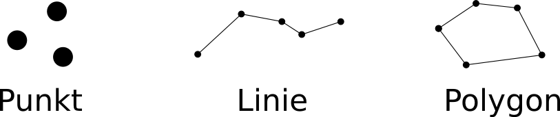
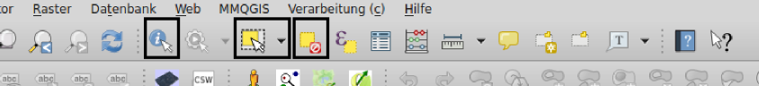
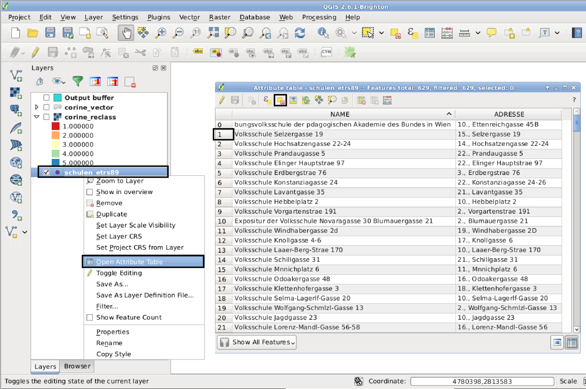
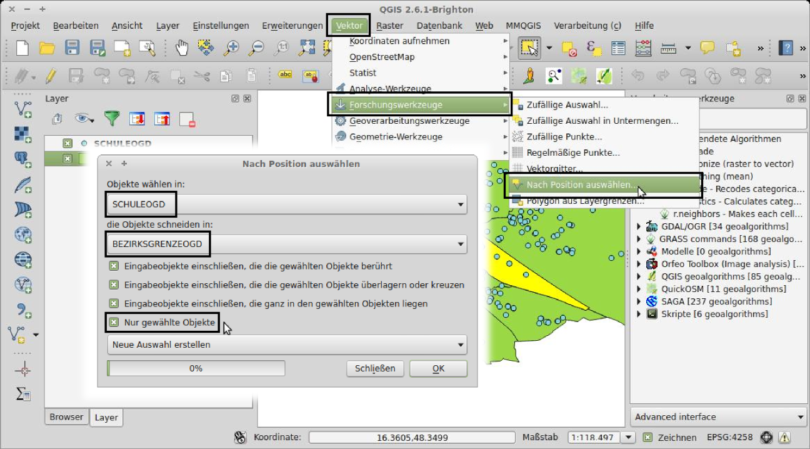
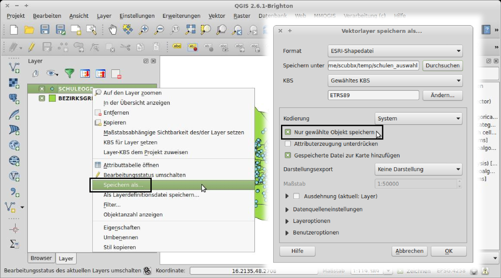
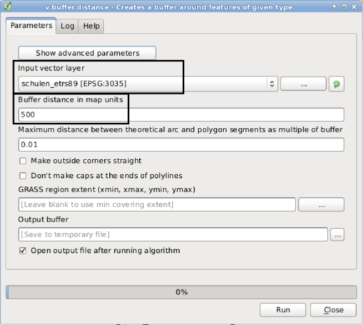
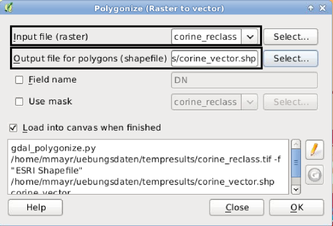
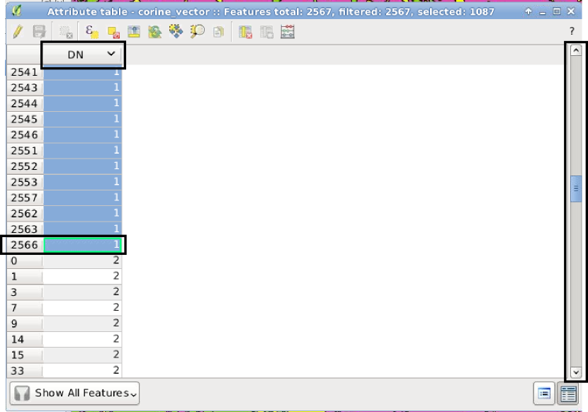
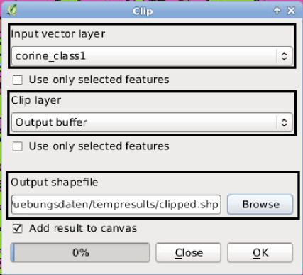

Übung 4: Vektordaten
====================

GIS Vektordaten
---------------

Neben sogenannten topologischen Dateiformaten ist der heutzutage gebräuchlichste Weg um vektorbasierte GIS Daten abzuspeichern das *OGC Simple Features Modell* [#f7]_ .
Dieses erlaubt die Beschreibung von Geoinformation mit den drei typen: *Punkte*, *Linien* und *Polygone* (siehe Abbildung :num:`#figvector`). Des weiteren ist es noch möglich, Gruppen aus jeweils diesen Elementen zu definieren, welche sich dann entsprechend *Multi-Punkte*, *Multi-Linien* und *Multi-Polygone* nennen.

.. _figvector:

    
    Die drei primären Datentypen laut dem OGC Simple Feature Standard

Es lässt sich nahezu jedes 2-dimensionale Objekt mit diesen drei Typen beschreiben.
Jedes einzelne Element (ein Punkt, eine Linie, ein Polygon) kann zusätzlich mit einem oder mehreren Attributen versehen werden. Üblicherweise ist das eine Laufnummer (*ID* genannt) und oftmals eine Typenbezeichnung. Die genaue Auswahl dieser Eigenschaften ist vom Anwendungsfall abhängig und vollständig dem Benutzer überlassen.
Diese Attribute lassen sich einfach in einer Tabelle darstellen. Jede Reihe dieser Tabelle beschreibt einen Eintrag im Datensatz. Solch ein einzelner Eintrag wird im Allgemeinen als *Feature* bezeichnet, egal ob es sich um einen Punkt, eine Linie oder ein Polygon handelt.

Es gibt Ansätze, den 3-dimensionalen Raum zu beschreiben, wir werden uns in der Übung aber auf den klassischen Fall einfacher Kartendarstellungen in 2D beschränken.

Das Shapefile
-------------

Als Standard zur Speicherung von Vektordaten hat sich in der GIS Welt das *Shapefile* Format durchgesetzt. Dieses Format wurde ursprünglich von der Firma ESRI [#f9]_ entwickelt. Da der Standard für die Benutzung dieses Dateiformats kostenlos freigegeben wurde, hat sich dieses Format weltweit durchgesetzt und ist, obwohl es inzwischen heillos veraltet ist, immer noch der de-facto Standard. Es gibt bereits eine Unzahl an weiteren Vektorformaten, die das Shapefile ablösen wollen, doch konnte sich bis jetzt keines davon durchsetzen.

Eine bezeichnende Eigenschaft eines Shapefiles ist, dass sich ein einzelnes Shapefile aus mehreren Dateien zusammensetzt. Sehen Sie sich den Link unter [#f8]_ an, um die Bedeutung der einzelnen Dateien zu verstehen.

.. topic:: Aufgabe 15
    
    Benennen Sie die Datei, welche für die Speicherung der Geometriedaten zuständig ist.

Wir hatten in der vorhergehenden Übung bereits kurz Kontakt zu einem Vektordatensatz: die Bezirksgrenzen von Wien.

Laden und Selektieren von Vektorobjekten
----------------------------------------

Wir sehen uns nun den Datensatz *SCHULEOGD* aus den Übungsdaten an. Dieser Datensatz ist in einem andern Koordinatensystem als das von uns gewünschte gespeichert. Somit ist es zunächst nötig, diesen Datensatz, so wie in der vorhergehenden Übung beschrieben, in das von uns gewählte ETRS89 Koordinatensystem umzuspeichern und diese umprojezierten Daten zu laden.

.. topic:: Aufgabe 16:
    
    * Laden Sie den aus der vorhergehenden Übung umprojezierten *BEZIRKSGRENZEOGD* Datensatz oder projezieren Sie diesen erneut um.
    * Projezieren Sie den Datensatz *SCHULEOGD* in das ETRS89 Koordinatensystem um und laden Sie diesen, sofern dies nicht automatisch geschehen ist.
    * Stellen Sie sicher, dass als das projektweite Kooridnatensystem ebenfalls ETRS89 eingestellt ist.

Stellen Sie sicher, dass der *SCHULEOGD* Layer über dem mit den Gemeindebezirken liegt. Um die Layer unter oder über einen andern zu schieben, kann man ihn mit der Maus an die Position ziehen, an der er dargestellt werden soll.

Sobald die beiden Vektorlayer geladen sind, sind sie in der *Layers (Layer)* Liste links vom QGIS Kartenfenster zu sehen. Auswahl- und Abfrageoperationen werden immer auf dem Layer ausgeführt, welcher gerade ausgewählt ist.

.. _figvectorselect:

    
    Die Icons zum (1) Abfragen von Attributen, zum (2) Auswählen von einzelnen Features und zum (3) Aufheben der Auswahl

Abbildung :num:`#figvectorselect` zeigt die Kommandos in der Symbolleiste, um Attribute eines Features abzufragen, ein Feature auszuwählen und um die Auswahl wieder aufzuheben.
Um beispielsweise den 2. Bezirk auszuwählen, muss das entsprechende Icon in der Symbolleiste ausgewählt werden und der 2. Bezirk im Kartenfenster angeklickt werden. Dieser färbt sich Gelb, was anzeigt, dass er ausgewählt wurde.

Wie zuvor erwähnt, sind die Attribute eines Shapefiles (wie auch bei fast allen anderen vektor-basierten GIS Dateiformaten) in einer Tabelle gespeichert, welche mit den Kartendaten verknüpft ist. In QGIS kann man sich diese Tabelle ansehen, indem man mit der Rechten Maustaste auf den entsprechenden Layer klickt und im daraufhin erscheinenden Menü den Eintrag *Open Attribute Table* auswählt (siehe Abbildung :num:`#figattrib`).

.. _figattrib:

    
    Die Attributtabelle eines Vektorlayers

Im Fall der Wiener Schulen kann man erkennen, dass jede Schule (Zeilen in der Tabelle) jeweils ein Attribut mit den Namen `NAME` und `ADRESSE` bestitzt. Wenn man auf eine eine Zahl ganz links in der Tabelle klickt, wird genau dieses Feature ausgewählt. Das ist nützlich, wenn man ein bestimmtes Feature mit genau einer bestimmten Adresse bearbeiten will. Mit einem Klick auf den *Unselect all* Knopf, wird diese Auswahl wieder aufgehoben.

Es ist möglich, Features eines Layers anhand deren Lage im Bezug zu einem anderen Feature auszuwählen. Der Befehl dazu findet sich im Menü unter *Vector* -> *Research Tools (Forschungswerkzeuge)* -> *Select by Location (Nach Position auswählen)*.

.. _figqgisvectorselect:

    
    Die Funktion zur Auswahl von Objekten nach ihrer Lage

Es öffnet sich das Fenster wie in Abbildung :num:`#figqgisvectorselect` dargestellt.
Im Feld *Select features in (Objekt wählen in)* wird der Layer eingestellt, aus welchem Objekte ausgewählt werden. Das Feld *that intersect features in (die Objekte schneiden in)* beschreibt den Layer, der die Grenzen beinhält, aus innerhalb derer ausgewählt wird. Eine wichtige Option, welche in unserem Fall ausgewählt sein muss, ist *Only selected features (Nur gewählte Objekte)*.

Um nur eine Auswahl an Features in eine neue Datei abzuspeichern, nutzen wir abermals die *Save as... (Speichern als ...)* Funktion, die mithilfe eines Rechtsklicks auf den jeweiligen Layer gefunden werden kann.

.. _figqgissaveselect:

    
    Um nur die ausgewählten Features zu speicher, genügt die Auswahl einer Option im *Save as... (Speichern als ...)* Dialog

Abbildung :num:`#figqgissaveselect` zeigt das Fenster, in welchem die Option *Save only selected features* ausgewählt sein muss, damit nur die derzeit ausgewählten Features gespeichert werden.

.. topic:: Aufgabe 17
    
    * Wählen Sie mit der oben beschriebenen Methode alle Schlulen aus, welche im 2. Wiener Gemeindebezirk liegen.
    * Speichern Sie nur diese Schulen in einer eigenen Datei ab und laden Sie diese, sofern dies nicht bereits automatisch geschehen ist.

Buffer Operationen
------------------

Für viele Aufgaben sind sogenannte Bufferzonen hilfreich - zum Beispiel können Bufferzonen entlang von Straßenachsen gebildet werden, um die Beeinträchtigung durch den Lärm in der Nähe der Straße abzuschätzen. Buffer können um beliebige Vektorobjekte gebildet werden. Für manche Aufgaben sind auch richtungsabhängige Buffer sinnvoll - zum Beispiel könnte der Lärm entlang einer bestimmten Richtung durch Bäume oder Mauern gedämpft werden und somit die Bufferzone entlang dieser Richtung kleiner sein.

..
    .. _figbuffer:
    
    .. figure:: images/qgis_vbuffer.png
        :scale: 70%
        
        Die *Processing* Funktion *Fixed distance buffer*
    
    Abbildung :num:`#figbuffer` zeigt die *Processing* Funktion *Fixed distance buffer*. Unter *Distance* kann die Distanz für die Bufferzone angegeben werden. Eine sehr praktische Option ist *Dissolve result*, mit welcher das Ergebnis, sofern es überlappt, zu einem einheitlichen Polygon zusammengefasst wird.

.. _figbuffer:

    
    Die *Processing* Funktion *v.buffer.distance*

Abbildung :num:`#figbuffer` zeigt die *Processing* Funktion *v.buffer.distance*. Unter *Buffer distance in map units* kann die Distanz für die Bufferzone angegeben werden. Wichtig dabei zu beachten ist, dass man unbedingt einen entsprechend in Metern projezierten Layer verwendet, da ansonsten die Pufferdistanz in Grad verstanden wird. In diesem Fall erzeugt man schnell Pufferzonen, die um die halbe Weltkugel reichen.
Das Ergebnis dieser Operation ist ein oder mehrere Polygon in einem Layer, welche die Bufferzonen um den Eingabelayer darstellen.

.. topic:: Aufgabe 18
    
    Gesucht ist die Zone, die innerhalb von 500 Metern zu einer Schule liegt. Nutzen sie einen Buffer, um diese Zonen zu berechnen und darzustellen.
    
Raster in Vektoren Umwandeln
----------------------------

In vielen Situationen ist es sinnvoll, einen Rasterlayer in einen Vektorlayer umzuwandeln. Dabei wird ein Raster in seiner Qualität nicht verbessert. In den meisten Fällen werden aus einem Raster Polygone erzeugt, es existieren jedoch auch Funktionen, Linien oder Punkte aus einem Raster zu erzeugen.

Um solch eine Umwandlung durchzuführen, gibt es abermals mehrere Möglichkeiten. Wir werden jene benutzen, welche fest in QGIS verankert ist und im Menü unter *Raster* -> *Conversion (Konvertierung)* -> *Polygonize (Vektorisieren)* aufgerufen werden kann. Wir werden nun beispielsweise den zuvor von uns neu klassifizierten CORINE Landbedeckungslayer vekotrisieren. Dazu muss dieser zunächst geöffnet werden, sofern er nicht schon geladen ist. Das Fenster der Vektorisierungsfunktion sieht wie in Abbildung :num:`#figvectorize` dargestellt aus.

.. _figvectorize:

    
    Mit der Funktion *Polygonize (Vektorisieren)* kann man Raster in Vektor-Polygone umwandeln

Es muss ein Dateiname zum Abspeichern angegeben werden. Mit einem Klick auf *OK* wird der Prozess gestartet und die vektorisierte Variante wird geladen. Wenn wir einen Blick auf die Attributtabelle des neu erstellen Vektorlayers werfen, sehen wir, dass genau ein Attribut mit dem Namen `DN` existiert. Dies ist der Wert, welchen wir pro Klasse beim Reklassifizieren des CORINE Layers eingegeben hatten (siehe Abbildung :num:`#figselectattr`).

.. _figselectattr:

    
    Wenn man die Tabelle nach der gewünschten Spalte sortiert, kann man leicht alle gewünschten Elemente einer Klasse auswählen

Um nun alle Features einer bestimmten Klasse auszuwählen, sollten wir zunächst die Tabelle nach der Spalte *DN* sortieren. Dazu klicken wir einfach darauf. Nun kann mit einem Klick auf die (in unserem Fall) Zahl `4` der erste Eintrag ausgewählt werden. Nun scrollen wir so weit nach unten, bis wir den letzten Eintrag mit dem Wert `1` sehen (in unserem Fall trägt dieser die Nummer `2566`). Um nun alle Einträge zwischen diesem und dem zuvor von uns Markierten auszuwählen, klicken wir auf den letzten Eintrag, während wir die *Umschalt* Taste gedrückt halten.
Wenn die Attributtabelle geschlossen wird, bleibt die Auswahl weiterhin bestehen. Man kann dies daran erkennen, dass alle von uns ausgewählten Flächen Gelb eingefärbt sind. Nun kann man, ähnlich wie mit den Schulen des 2. Bezirks zuvor, diese Auswahl in einer eigenen Datei abspeichern.

.. topic:: Aufgabe 19
    
    Gesucht ist der Standort für eine neue Schule. Die Schule soll
    
    * mindestens 500 Meter von allen anderen Schulen entfernt sein und
    * in einem Gebiet mit der CORINE Klassifikation "künstliche Flächen"
    
    liegen. Dazu können Sie den zuvor berechneten Bufferlayer der Schulen und die vektorisierte CORINE Klassifikation, die nur die Klasse 1 enthält, benutzen. Erinnern Sie sich, die Klasse 1 beschreibt genau alle "künstlichen Flächen".
    
    Erzeugen Sie diese beiden Datensätze und setzen Sie gleich mit der folgenden Aufgabe fort. Sie müssen für diese Aufgabe kein Bild oder Screenshot anfertigen.

Overlay Operationen
-------------------

Mithilfe von Overlay Operationen können meherere Layer miteinander kombiniert werden. Dazu gibt es verschiedene Varianten, oft als *or*, *not* oder *xor* bezeichnet. Diese verschneiden zwei Vektorlayer mit unterschiedlichen Resultaten. Wir werden uns die *or* Operation näher ansehen, in QGIS wird diese auch als *Clip* bezeichnet.
Die *Clip* Funktion findet man im Menü unter *Vector* -> *Geoprocessing (Geoverarbeitungswerkzeuge)* -> *Clip (Clipper)* und sieht wie auf Abbildung :num:`#figclip` dargestellt aus.

.. _figclip:

    
    Mit der *Clip (Clipper)* Funktion können gemeinsame Flächen zwei verschiedener Layer berechnet werden

.. topic:: Aufgabe 20
    
    Um einen gemeinsamen Datensatz, der zuvor genannte Kriterien (Aufgabe 19) für eine neue Schule erfüllt, zu erzeugen, kombinieren Sie den Pufferdatensatz mit dem vektorisierten der CORINE Klasse 1.
    
    **Hinweis:** Da wir nicht die gemeinsame Fläche der 500 Meter Zone um bestehende Schulen (nicht gesucht) und der künstlichen Flächen (gesucht) suchen, ist die `clip` Funktion hier die falsche Wahl. Ein richtiges Ergebnis erzielen wir mit der `Difference (Differenz)` Funktion, welche uns die Bereiche berechnet, die sich nicht überlappen.

Delaunay-Triangulation und Voronoi-Diagramme
--------------------------------------------

Eine Delaunay-Triangulation verbindet gegebene Punkte zu Dreiecken, sodass der Umkreis eines jeden Dreiecks keinen weiteren Punkt enthält. Delaunay-Triangulationen werden für die Erstellung von digitalen Geländemodellen (DGM) verwendet, indem man die Punkte, an denen die Geländehöhen beobachtet wurden, trianguliert und die Höhen zwischen den Punkten interpoliert.

Bildet man zu jeder Kante der Triangulation Ihre duale Kante, also die Streckensymmetralen der Dreieckskante, so erhält man das zugehörige Voronoi-Diagramm. Das Voronoi-Diagramm unterteilt ein Gebiet in sogenannte Voronoi-Zellen. Voronoi-Diagramme verden in GIS Anwendungen für die Modellierung von Einzugsgebieten verwendet.

Mit den Algorithmen *v.delaunay* und *v.voronoi* aus der *Processing Toolbox* lassen sich Delaunay-Triangulation und Voronoi-Diagramme berechnen.

.. topic:: Aufgabe 21
    
    Gesucht ist die nächste Schule zu Ihrem Wohnort. Berechnen Sie dazu zunächst die Voronoi-Diagramme der Schulen innerhab Wiens. Dann markieren Sie mit der am Beginn besprochenen Auswahlfunktion jene Zelle des Voronoi-Diagramms, in welcher Ihre Wohnadresse liegt.

Abgabe
------

Beantworten Sie die Fragen, fügen Sie alle Ergebnisse in eine pdf Datei und kommentieren Sie kurz die Ergebnisse. Vergessen Sie nicht, bei jeder Aufgabe ein Bild anzufertigen, das Ihr Ergebnis zeigt. Die Abgabe erfolgt im TUWEL.

.. [#f7] http://grass.osgeo.org/grass64/manuals/r.mapcalc.html

.. [#f8] http://de.wikipedia.org/wiki/Shapefile

.. [#f9] http://www.esri.com
