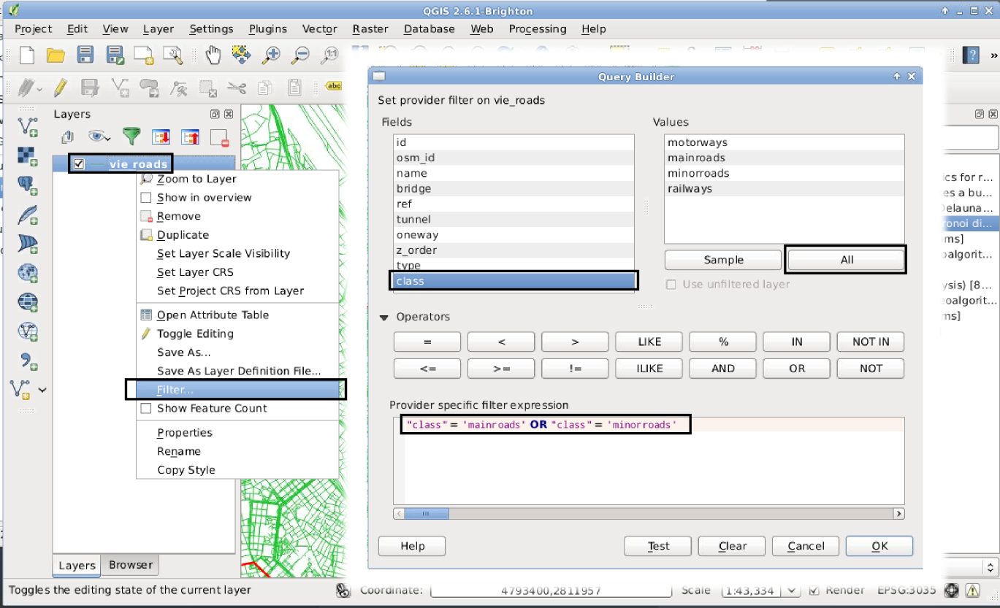
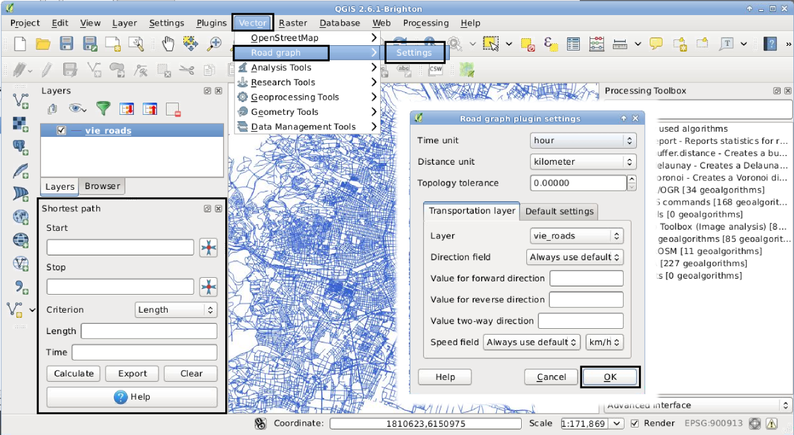

Übung 5: Netzwerkoperationen
============================

In dieser Übung wird ein Auszug aus OpenStreetMap (OSM) verwendet. Unter [#f10]_ werden täglich aktuelle Auszüge aus dem OSM-Datensatz im Shapefile-Format bereitgestellt. Die Daten für diese Übung wurden aufgrund der Größe auf das Wiener Gemeindegebiet eingeschränkt.

Datenaufbereitung
-----------------

Laden Sie zunächst den Datensatz *vie_roads* aus den Übungsdaten in QGIS. Wie sie sehen können, beinhält dieser alle Straßen und Bahngleise innerhalb Wiens.
Uns interessieren aber nur die Begehbaren Straßen. Daher müssen wir auch nur diese herausfiltern.

QGIS bietet dafür bei Vektorlayern eine interessante Funktion namens *Filter*. Mit einem Rechtsklick auf den gewünschten Layer kann diese ausgewählt werden (siehe Abbildung :num:`#figfilter`).

.. _figfilter:

    Die *Filter* Funktion in QGIS

Nun kann mit einer Syntax ähnlich jener von SQL ein Filter angegeben werden, nach dem die Daten gefiltert werden. Für QGIS sieht es danach so aus, als ob die Datei tatsächlich nur jene Features beinhalten würde, die die Filter Funktion passieren.
Die Liste mit dem Titel `Fields (Felder)` listet alle verfügbaren Attributklassen auf. Uns interessiert derzeit das Feld `class`, also sollten wir es auswählen. Mit einem Klick auf den Knopf `All (Alle)` werden im darüberliegenden Feld alle Attributwerte der ausgewählten Attributklasse aufgelistet. In unserem Fall geschieht dies sehr schnell, wenn man aber mit Datensätzen mit Millionen von Einträgen arbeitet, sollte man besser den Knopf mit der Aufschrift `Sample (Stichprobe)` benutzen. Anderenfalls kann die Prozedur zum Laden aller möglichen Einträge sehr viel Zeit in Anspruch nehmen.

Wir können nun erkennen, dass in der Attributklasse `class` nur vier verschiedene Einträge vorkommen: `motorways`, `mainroads`, `minorroads` und `railways`. In unserem Fall interessieren uns nur die *mainroads* und *minorroads*, denn nur diese können auch zu Fuß begangen werden.
Um diese herauszufiltern, schreiben wir folgende Formel in das Feld mit dem Titel `Provider specific filter expression (Datenlieferanten spezifischer Ausdruck)`:

    ``"class" = 'mainroads' OR "class" = 'minorroads'``

Nach einem Klick auf *OK*, wird die Anzeige aktualisiert und nur mehr Haupt- und Nebenstraßen gezeigt.

.. topic:: Aufgabe 22

    Filtern Sie alle Autobahnen und Bahnschienen aus dem Datensatz, sodass nur mehr Haupt- und Nebenstraßen geladen werden.

Kürzester Weg
-------------

Der kürzeste Weg wird mit dem Dijkstra-Algorithmus [#f11]_ berechnet. Im QGIS Plugin *Road graph plugin* (Straßengraph-Erweiterung) ist dieser Algorithmus enthalten. Die Funktion wird mit Hilfe eines andockbaren Fensters bereitgestellt, das im Menü unter *View* (Ansicht) -> *Panels* (Bedienfelder) -> *Shortest Path* (Kürzester Weg) aktiviert werden kann, sofern es nicht schon sichtbar ist. Falls sich diese Option nich im Menü finden lässt, muss sie zuerst im Pluginmanager aktiviert werden. Dort trägt sie den Namen *Straßengraph Erweiterung (Road Graph Plugin)*.

.. _figroute:

    Die *Shortest-Path* Funktion in QGIS

Wie in Abbildung :num:`#figroute` dargestellt, müssen zunächst die Einstellungen des Plugins im Menü unter *Vektor* (Vector) -> *Straßengraph* (Road Graph) -> *Einstellungen* (Settings) geöffnet werden, damit bestimmte Standardoptionen automatisch gesetzt werden. Hier kann man diverse Optionen angeben, welche wir so lassen, wie sie sind. Das Fenster kann mit einem Klick auf *OK* geschlossen werden.

Um nun die kürzeste Route zwischen zwei Punkten zu berechnen, klicken wir zunächst auf das erste Fadenkreuz neben dem Feld, welches mit *Start* beschriftet ist, und dann auf die Stelle in der Karte, an der wir starten wollen. Wir führen den Gleichen Schritt mit dem Fadenkreuz unterhalb des ersten aus, um den Endpunkt zu markieren. Um die Berechnung zu starten, klicken Sie auf **Calculate (Berechnen)**.

.. topic:: Aufgabe 23

    Berechnen Sie die kürzeste Route zwischen einem beliebigen Ausgangspunkt (z.Bsp. Ihrem Wohnort) und der TU Wien (oder dem Karlsplatz). Verwenden sie dafür den zuvor gefilterten Datensatz um eine realistische Route für Fußgänger zu berechnen.

..
    Erreichbarkeitszonen
    --------------------

..
    Erfassen von eigenen Daten
    --------------------------

    Daten können über automatische Prozesse oder auch manuell erstellt werden. In vielen Fällen erhält man bereits Datensätzt, die einfach in das GIS geladen werden können. Manchmal ist es dennoch notwendig Features per Hand einzutragen.

    QGIS stellt dafür eine ganze Palette an Hilfsmitteln zur Verfügung, von denen wir uns

Abgabe
------

Fügen Sie alle ausgegebenen Dateien in eine pdf Datei und kommentieren Sie kurz die Ergebnisse. Beantworten Sie die Fragen im Text. Die Abgabe erfolgt über TUWEL.

.. [#f10] http://www.geofabrik.de

.. [#f11] http://de.wikipedia.org/wiki/Dijkstra-Algorithmus
